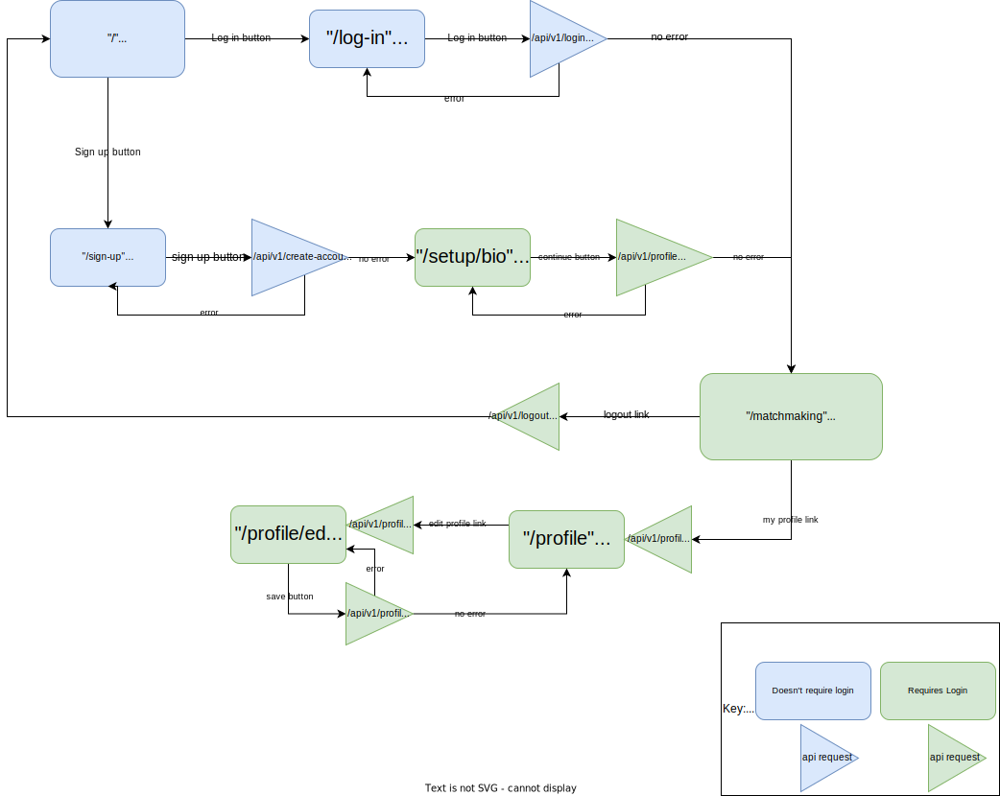
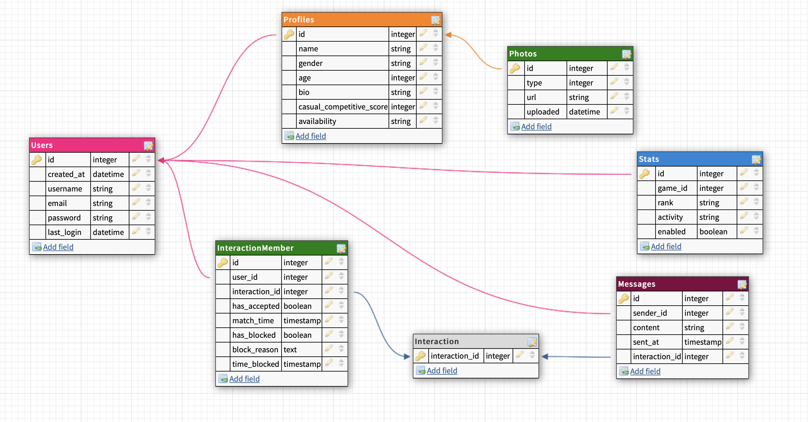

# Instructions

#### Requirements:
- python
- npm
- PostgreSQL
- AWS account
- Twilio account
#### Setup:

Create .env from template:
```sh
# copy example config to .env
cp config-template .env
```

Edit .env to add your AWS & SendGrid credentials and config:

```ini
DB_NAME="riot_buddy"
DB_PORT=5432
DB_HOST="localhost"

APP_SECRET_KEY="spcQX4vdFhfyIlTXA2iibVRS3q17alj4"
MAX_FILE_SIZE_IN_MB=16

AWS_REGION="us-east-2"
AWS_ACCESS_KEY_ID="access key id......"
AWS_SECRET_ACCESS_KEY="secret access key................"

PFP_BUCKET_NAME="riot-buddy-photos"

SENDGRID_ENABLED='true'
SENDGRID_API_KEY="sendgrid api key............."
SENDGRID_SENDER="sender email here....."
```

Install dependencies and run init.py script:

```sh
# install node dependencies:
npm install

# install python dependencies:
pip install -r riot_buddy/requirements.txt

# install app package:
pip install -e riot_buddy

# initialize cloud environment and database:
# (this make take 2-10 minutes to fully deploy on AWS)
python init.py
```

#### 🔬 Run development:
```sh
npm start
flask --app riot_buddy --debug run
```
👉 http://127.0.0.1:3000/

#### 🚀 Run production:
```sh
npm run build
flask --app riot_buddy run
```

👉 http://127.0.0.1:5000/

## Application Flow Model



## Database Schema (outdated)



## API specification

- [x] POST /api/v1/create-account
  - description:
    - used to create the users account on initial signup
  - request:
    - string: email
    - string: username
    - string: password
  - response:
    - string: error (empty if no error)
    - (header) session cookie

- [x] GET /api/v1/login
  - description:
    - used to login to account with given username and password
  - request:
    - string: username
    - string: password
  - response:
    - string: error (empty if no error)
    - (header) session cookie

- [x] GET /api/v1/logout
  - description:
    - used to log the user out, revoking their access
  - request:
    - (header) session cookie
  - response:
    - OK

- [x] GET /api/v1/whoami
  - description
    - used to show the current users username, from their session
  - request:
    - (header) session cookie
  - response:
    - string: username

- [x] POST /api/v1/profile
  - description:
    - used to create the users profile
  - request:
    - (header) session cookie
    - string: name
    - string: bio
    - string: pronouns
    - integer: age
    - integer: competitiveness (1-10)
  - response:
    - string: error (empty if no error)

- [x] GET /api/v1/profile
  - description:
    - used to retrieve another users profile. if no id is specified, retrieve the users own profile
  - request:
    - (header) session cookie
    - (argument) integer: id
  - response:
    - integer: profile id
    - string: name
    - string: bio
    - string: pronouns
    - integer: age
    - string: photo url (optional)
    - integer: competitiveness (1-10)

- [x] PUT /api/v1/profile
  - description:
    - used to edit the users profile
  - request:
    - (header) session cookie
    - string: name
    - string: bio
    - string: pronouns
    - integer: age
    - integer: competitiveness (1-10)
  - response:
    - string: error (empty if no error)

- [x] PUT /api/v1/profile/photo
  - description:
    - used to overwrite the default profile picture with a user uploaded one
  - request:
    - (header) session cookie
    - (form data) file: photo
  - response
    - string: error (empty if no error)

- [ ] POST /api/v1/interact
  - description:
    - used to record if a user accepted or rejected a profile and check match status
  - request:
    - (header) session cookie
    - integer: profile id
    - bool: accepted
  - response:
    - string: error (empty if no error)
    - bool: match

- [ ] GET /api/v1/interact/next
  - description:
    - used to get the next profile id to interact with
  - request:
    - (header) session cookie
  - response:
    - string: error (empty if no error)
    - integer: profile id

- [ ] GET /api/v1/matches
  - description:
    - used to get a list of profile id's that the user has matched with
  - request:
    - (header) session cookie
  - response:
    - string: error (empty if no error)
    - integer[]: profile id
